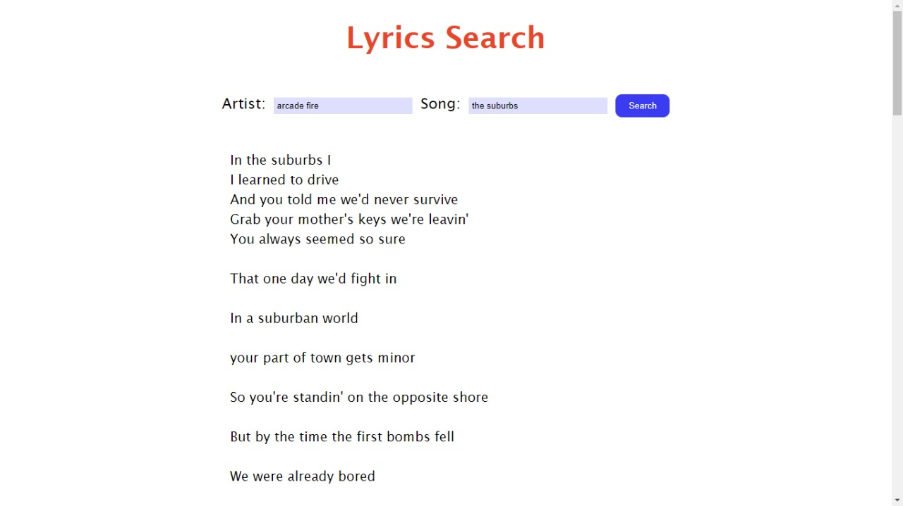

# Search Lyrics
Aplicação para buscar letras de músicas com consumo de API restful.

 ## Objetivo 
 Desenvolver um projeto simples com JavaSript para entender melhor o uso de:
- Promises
- Fetch
- Async await
- Try catch
### Para testar 

[Clique aqui](https://monalizavitor.github.io/search-lyrics/)

